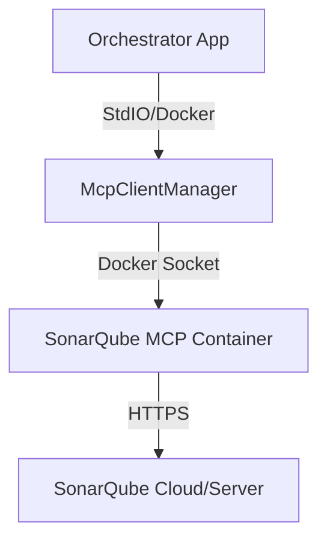

# SonarQube MCP Server Integration Plan

## 1. Overview
We will integrate the **SonarQube MCP Server** into the Orchestrator to enable direct access to code quality and security metrics during the SDLC workflow. This empowers agents (specifically `CodeReviewExecutor` and `DodExecutor`) to make data-driven decisions based on real static analysis results.

## 2. Architecture
The SonarQube MCP Server will run as a **sibling Docker container** managed by the `McpClientManager`, consistent with the existing Git and GitHub MCP server integration.

### Deployment Diagram

## 3. Configuration
New environment variables will be added to `.env` and `OrchestratorConfig.cs`:

*   `SONAR_HOST_URL`: The URL of the SonarQube instance (e.g., `https://sonarcloud.io`).
*   `SONAR_TOKEN`: Authentication token for API access.

## 4. Workflows

### 4.1 Code Review Executor
The `CodeReviewExecutor` will be updated to:
1.  Check if SonarQube analysis is available for the current PR/Branch.
2.  Invoke the MCP tool `sonarqube_get_new_issues` (or equivalent).
3.  Incorporate these findings into the review summary.
4.  Differentiate between "AI findings" (semantic) and "SonarQube findings" (static).

### 4.2 DoD Gate Executor
The `DodExecutor` will enforce hard quality gates:
1.  Invoke `sonarqube_get_quality_gate_status`.
2.  If status is `ERROR` or `WARN` (configurable), the gate fails automatically.
3.  Check specific metrics (e.g., coverage < 80%) if the Quality Gate is too loose.

## 5. Implementation Steps

### Phase 1: Infrastructure (Foundation)
- [ ] Add `SONAR_HOST_URL` and `SONAR_TOKEN` to `OrchestratorConfig`.
- [ ] Update `McpClientManager` to launch `sonarsource/sonarqube-mcp-server` (image name TBC).
- [ ] Verify connection and tool listing (`initialize` handshake).

### Phase 2: Workflow Logic
- [ ] Update `CodeReviewPrompt` to inform the LLM about the available SonarQube tools.
- [ ] Update `DodExecutor` to call the Quality Gate tool programmatically.
- [ ] Add tests for new interactions.

## 6. Prerequisites
- A running SonarQube instance (Cloud or Server).
- A valid SonarQube Token.
- CI pipeline configured to run the SonarScanner on branches created by the Orchestrator.
